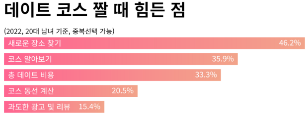
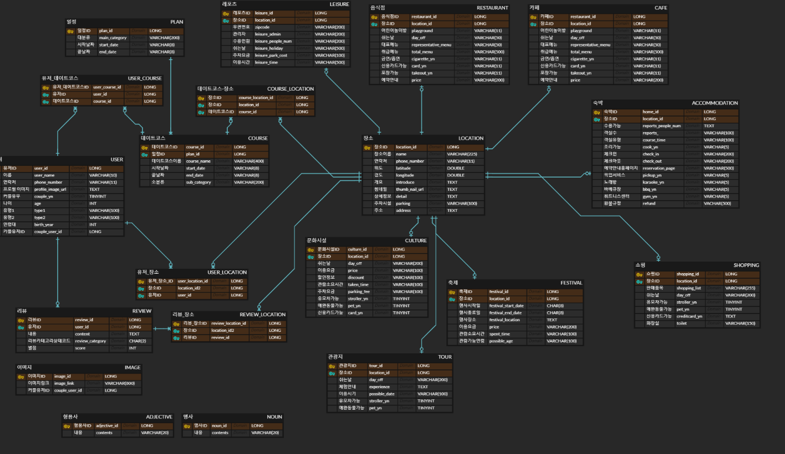

# 🌸 COSMOS 🌸

코스는 우리가 짜줄게 너희는 데이트만 해 
사용자 맞춤 데이트코스 추천 플랫폼

> 삼성청년SW아카데미(SSAFY) 특화 프로젝트 (2023.02.20.~2023.04.07, 46일간 진행)

  
🌸팀 노션 : [팀 노션 링크](https://sunakang.notion.site/sunakang/5cc3595584474826abb48218275d8926)
  

## 1️⃣ 기획배경

- 설문조사 결과 데이트 할 때 가장 신경 쓰이는 것으로 ‘장소 & 음식점 선정’이 도합 **42.5%** 로 가장 많은 비율을 차지하고 있다. 20대 남녀 기준 ‘새로운 장소 찾기’가 **46.2%** , ‘코스 알아보기’가 **35.9%** 로 **데이트 코스 선정에 있어 어려움이 있다**고 밝혔다.  

- 이에 설문조사를 기반으로 커플 모두 만족할 수 있는 **데이트 코스를 추천**해줌으로써 **데이트 일정 짜기에 소요되는 시간과 스트레스를 줄이고**자 한다.  

  
## 2️⃣ **주요 고객 및 고객이 얻는 이익**

- AI를 통해 사용자 맞춤형 데이트 코스를 추천 받을 수 있어서 **일정 짜는데에 대한 소요 시간**을 줄일 수 있다. 
- 찜 장소를 수정, 생성하여 **자유롭게 커스텀** 할 수 있으며, 최적 경로를 통해 **이동 시간과 거리를 한눈에 파악**할 수 있다. 
- 데이트 일정과 사진 공유를 통해 **커플들만의 추억**을 남길 수 있다. 

  
## 3️⃣ 활용되는 기술력, 차별성

## | 경쟁사 분석

- **데이트팝**

  - 장점
    1. 지역 별 데이트 코스 제공
    2. 카테고리 별 데이트 코스 제공
    3. 포스팅과 이용자들의 후기 한눈에 보기 쉬움
    4. 제휴샵이 많아 전시회부터 테마파크, 색다른 데이트까지 할인된 가격에 이용할 수 있음
  - 단점
    1. 수도권&일부 광역시 위주 → 타 지역 사용 어려움
    2. 이용권을 구매할 경우 조건에 따라 가격 변동 or 사용 제한 있음
    3. 이미 짜여진 데이트 코스 ⇒ 사용자 맞춤 추천 없음

- **트리플**
  - 장점
    1. 해외여행지 여행 코스 추천
    2. 숙박, 항공권 최저가 비교 및 예약
    3. 여행 가이드북
    4. 동행인과의 일정 공유(지도 동선 일정, 여행 가계부 등)
    5. 출발-도착 중 근처 맛집 & 관광지 추천
    6. 실제 사용자 후기
    7. 날씨, 환율, 길찾기, 번역, 시차 계산 기능
  - 단점
    1. 커플 전용 아님
    2. 대도시 기준이라 소도시들 검색이 안됨
    3. 해외 위주라 국내 분류가 잘 되어있지 않음
    4. 데이터가 최신화 되어있지 않음
    5. 숙박 & 항공 등 예약 취소 어려움
- **완벽한 하루**
  - 장점:
    1. 가격 제한을 둘 수 있음
    2. 깔끔한 UI
    3. 커뮤니티 존재
    4. 상세보기 들어갔을 때 그와 관련된 네이버 블로그 후기도 같이 볼 수 있음
    5. 지도에서 도보 안내 누르면 거리와 도보 이동 시간 볼 수 있음
  - 단점:
    1. AI 추천이 약간 하드코딩 느낌입니다. 반응이 없어요
    2. 취향 추천이 그냥 필터링으로 구현 되어 있고, 리뷰나 좋아요, 평점 순이 아니라 가까운 거리부터 그냥 보여주는 느낌이에요
    3. 서울 지역 이외에는 데이터가 거의 없는 것 같아요.
    4. 해쉬태그가 기능이 전혀 없고, 그냥 텍스트 찍는 게 끝
    5. 광고가 자주 뜸

## | 차별점

- AI를 활용한 사용자 맞춤 코스 추천
- 데이트 코스는 자유롭게 생성, 수정, 삭제가 가능하며, 해당 코스의 최적 경로를 한눈에 파악할 수 있다.
   

  
## 4️⃣ **필요 기능**

- 카카오 소셜 로그인/로그아웃
- 설문조사(선호도 조사)
- 데이트 코스 추천(+ 최적 경로)
  - 음식점
  - 관광지
  - 카페
  - 문화생활(영화, 미술, 공연 등)
  - 숙박
- 장소 리뷰
- 알림
- 사진첩
- 일정 관리
- 커플 연결 & 연결 끊기
- 장소 찜 - 코스 커스텀(직접 - 최적경로 / 추천 - 랜덤)
 
🌸기능명세서 : [기능명세서 링크](https://sunakang.notion.site/55219461ce4f4aa3abd047c01c6d4cfc?v=93c3c103a46b49af822671d5b8ee7274)

  
## 5️⃣ 프로젝트 설계

### 프로토타입, 목업

🌸Figma : [Figma 링크](https://www.figma.com/file/fhHoMpS3dimLj9kwn0TAaM/cosmos?node-id=0%3A1&t=hlGp8iKnO0ls1Smm-0)

 

### ERD

 

### 시스템 아키텍처

 

  
##  6️⃣**사용 기술**

### Frontend
- ReactJS
- TypeScript
- React Query
- TMap API
- Recoil
- Kakao API
 

### Backend
- Spring Boot
- JPA
- Query DSL
- Spring Security
- JWT
- Redis
- SSE
- MySQL
- Docker
- Jenkins
- nginX
- HTTPS
- Kakao API
- Index
- Elasticsearch
 

### Server/DevOps
- AWS EC2, RDS, S3
 

### 형상관리
- Gitlab, Gather town, Notion, JIRA, Discord

  
## 7️⃣ 팀 구성

### 슈의 비비빅데이터

| 직책 | 이름   | 역할       |
| ---- | ------ | ---------- |
| 팀장 | 장시우 | 백엔드     |
| 팀원 | 김정윤 | 프론트엔드 |
| 팀원 | 김혜지 | 프론트엔드 |
| 팀원 | 반유진 | 프론트엔드 |
| 팀원 | 이상찬 | 백엔드     |
| 팀원 | 강수나 | 백엔드     |
